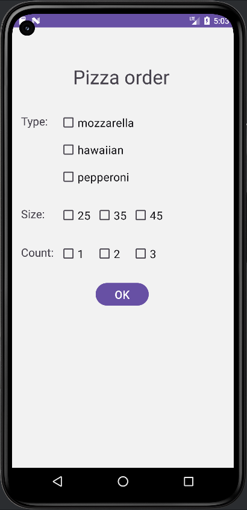
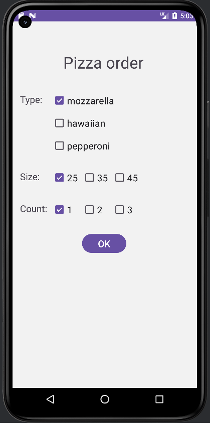
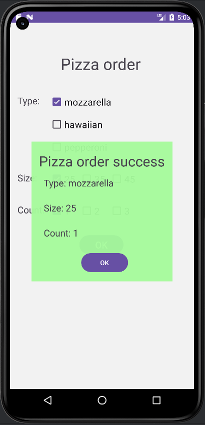
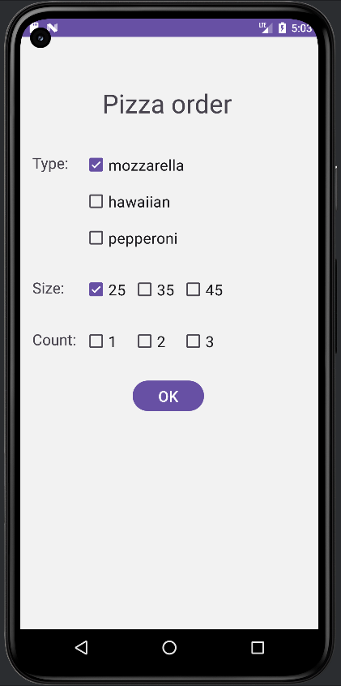
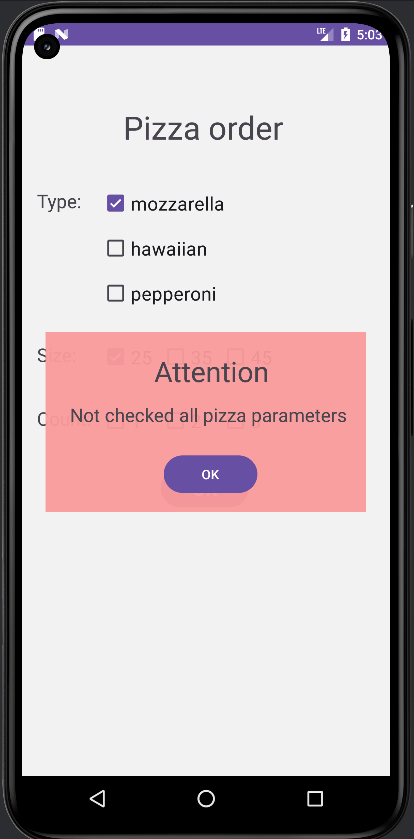

# Android_L1  Варіант 7

Телефонний застосунок для замовлення піци. 

На основному вікні застосунку можна вибрати тип ціци, розмір та кількість піц.

Якщо не вибрано якісь дані про піцу, при натискані на кноп підтвердження замовлення, з'являється попередження.

Якщо вибрано всі дані та натиснуто кнопуку, з'являється готовий ордер замовлення

## Перевірка роботи 

Запуск програми

Все вибрано

Підтвердження ордеру

Щось не вибрано

Попередження

